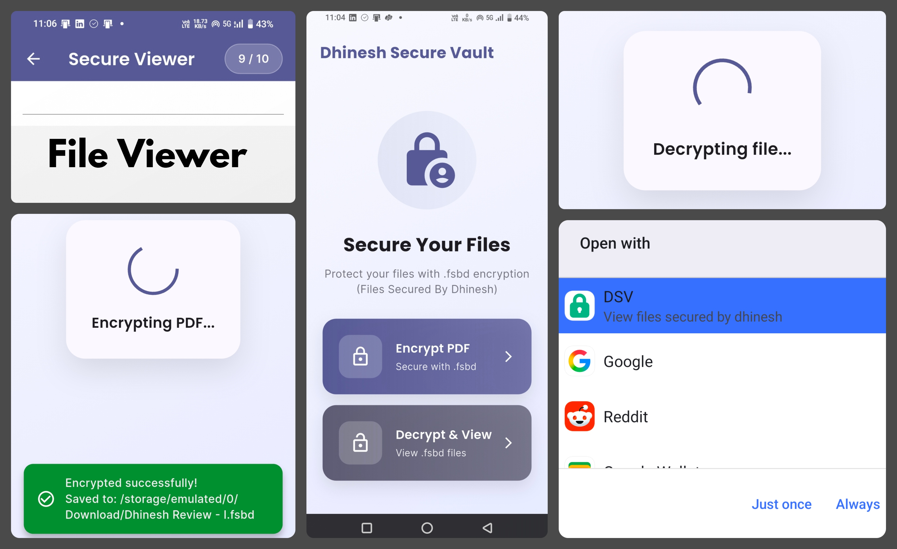

# Dhinesh Secure Vault 🔐

**Dhinesh Secure Vault** is a Flutter Android app that encrypts PDF files and allows secure viewing inside the app. It protects sensitive documents using strong encryption and prevents unauthorized access.

---
## Screenshot 

## 📱 About the App

This app allows you to:

* Encrypt PDF files into a secure `.fsbd` format
* Open and view encrypted files securely
* Prevent screenshots and screen recording
* Automatically delete temporary decrypted files
* Keep all data safe on your device

Everything works **offline**. No internet is required.

---

## 🔒 Security Features

* AES-256 encryption (very strong encryption)
* Screenshot and screen recording protection
* Files can only be opened inside this app
* No decrypted files are stored permanently
* Automatic secure cleanup
* No data collection

---

## ⚙️ Built With

* Flutter (Dart)
* Kotlin (Android native)
* AES-256 encryption
* cryptography package
* pdfx package

---

## 📂 How It Works

### Encrypt PDF

1. Open the app
2. Tap **Encrypt PDF**
3. Select a PDF file
4. Encrypted `.fsbd` file will be created

### View Encrypted File

1. Tap **Decrypt & View**
2. Select `.fsbd` file
3. File opens securely in the app

---

## 📁 File Format

* Input: `.pdf`
* Output: `.fsbd` (encrypted file)
* `.fsbd` files can only be opened using this app

---

## 🛡️ Privacy

* No internet access
* No tracking
* No analytics
* No cloud storage
* Everything stays on your device
---

## ⭐ Features Summary

* Secure PDF encryption
* Secure PDF viewing
* Screenshot protection
* Offline app
* Simple UI
* Strong security
